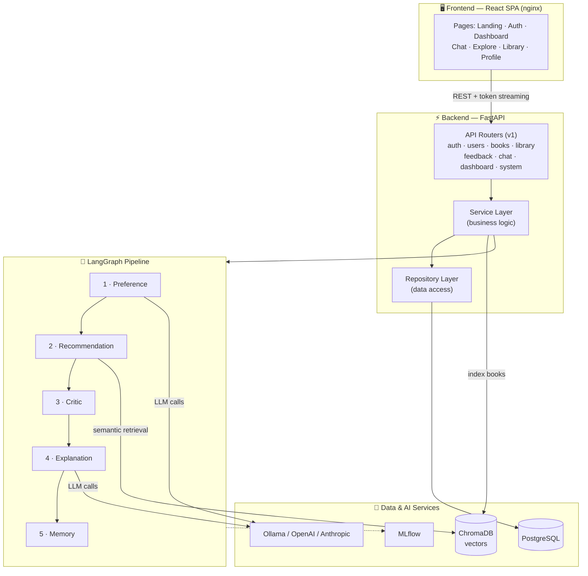
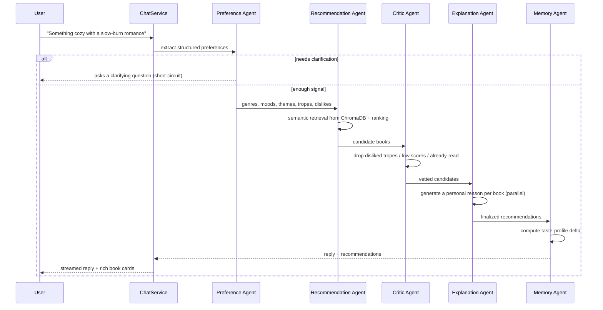
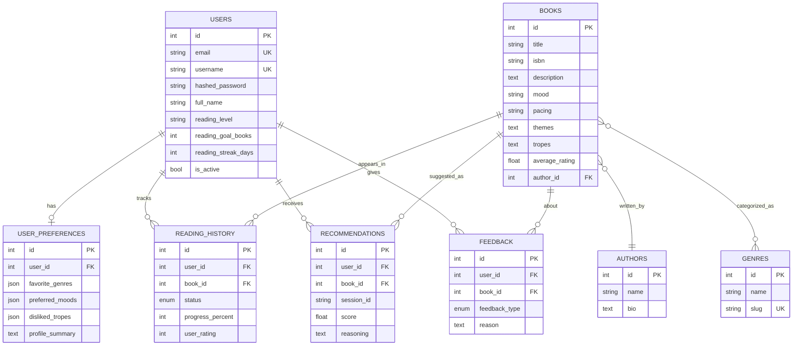

<div align="center">

# 📚 BookMind AI

### Find your next favorite book through conversation.

A production-grade, multi-agent book recommendation platform powered by **LangGraph**,
**Retrieval-Augmented Generation**, a vector database, an adaptive memory system, and
**LLM-driven reasoning** — delivering personalized recommendations from a simple chat.

[](https://www.python.org/)
[](https://fastapi.tiangolo.com/)
[](https://react.dev/)
[](https://langchain-ai.github.io/langgraph/)
[](https://docs.docker.com/compose/)
[](#-license)

</div>

---

## ✨ Highlights

- **Conversational discovery** — Describe a mood, a vibe, or a book you loved. A pipeline of
  specialized agents asks the right follow-ups and returns titles that actually fit.
- **Multi-agent reasoning (LangGraph)** — Six cooperating agents extract preferences, retrieve
  candidates, critique them, explain each pick, update long-term memory, and coach your reading.
- **Explainable recommendations** — Every suggestion comes with a clear, personal reason grounded
  in your taste profile and library — no black boxes.
- **Bring-your-own model OR fully offline** — Runs out-of-the-box with open-source models via
  **Ollama** (no API key). Switch to **OpenAI** or **Anthropic** with a single env var.
- **Adaptive memory** — Thumbs-up / thumbs-down feedback and chat history continuously refine
  your taste profile.
- **Production-grade architecture** — Clean layering (API → service → repository), async
  end-to-end, JWT auth, Alembic migrations, MLflow tracking, typed schemas, and a test suite.
- **One-command deploy** — `docker compose up --build` brings up the entire stack.

---

## 🧱 Tech Stack

| Layer            | Technology                                                                 |
| ---------------- | -------------------------------------------------------------------------- |
| **Frontend**     | React 18, TypeScript, Vite 6, TailwindCSS, React Router, TanStack Query, Zustand |
| **Backend**      | FastAPI, Pydantic v2, async SQLAlchemy 2.0, Uvicorn                         |
| **Agents / LLM** | LangGraph, LangChain, Ollama / OpenAI / Anthropic (pluggable)              |
| **RAG**          | ChromaDB (vector store) + `sentence-transformers` embeddings (local)       |
| **Database**     | PostgreSQL (asyncpg) + Alembic migrations                                  |
| **MLOps**        | MLflow (fail-safe LLM-call & recommendation tracking)                      |
| **Auth**         | JWT (access + refresh), bcrypt password hashing                            |
| **Infra**        | Docker, Docker Compose, nginx                                              |

---

## 🏛️ System Architecture



### The Multi-Agent Recommendation Pipeline

When you send a message, the request flows through a **LangGraph `StateGraph`** where each agent
enriches a shared state object:



| # | Agent              | Responsibility                                                                 |
| - | ------------------ | ------------------------------------------------------------------------------ |
| 1 | **Preference**     | Parses free text into structured taste signals; asks a clarifying question when the request is too vague. |
| 2 | **Recommendation** | Runs semantic retrieval over the vector store and ranks candidate books.       |
| 3 | **Critic**         | Rule-based filtering: removes disliked tropes, weak matches, and already-read titles. |
| 4 | **Explanation**    | Generates a concise, personalized reason for each surviving candidate (in parallel). |
| 5 | **Memory**         | Computes how this interaction should update the user's long-term taste profile. |
| ★ | **Reading Coach**  | A standalone agent that produces motivational, goal-aware coaching on the dashboard. |

---

## 🗄️ Database Schema



---

## 🚀 Quick Start

### Option A — Docker (recommended, one command)

> Requires [Docker Desktop](https://www.docker.com/products/docker-desktop/) (Compose v2).

```bash
# 1. Configure environment (sensible defaults — works offline, no API keys)
cp .env.docker.example .env

# 2. Launch the entire stack
docker compose up --build
```

Then open:

| Service              | URL                              |
| -------------------- | -------------------------------- |
| 🌐 **Frontend**      | http://localhost:3000            |
| 📖 **API docs**      | http://localhost:8000/docs       |
| 🧪 **MLflow**        | http://localhost:5000            |

**Pull a model for offline LLM inference** (first run only, in a second terminal):

```bash
docker compose exec ollama ollama pull llama3.1:8b
```

> Until a model is pulled, recommendations still work end-to-end — the backend gracefully
> falls back to a deterministic reply if the LLM is unavailable.

**Demo account** (pre-seeded): `demo@bookmind.ai` / `bookmind123` (pre-filled on the login page).

---

### Option B — Local development

<details>
<summary><b>Backend</b> (Python 3.12+)</summary>

```bash
cd backend
python -m venv .venv
# Windows:  .\.venv\Scripts\activate
# macOS/Linux: source .venv/bin/activate

pip install -r requirements.txt
cp ../.env.example .env          # adjust as needed

# Apply migrations (requires a running Postgres), then seed
alembic upgrade head
python -m scripts.seed

uvicorn app.main:app --reload
```

Run the test suite:

```bash
pytest
```

</details>

<details>
<summary><b>Frontend</b> (Node 20+)</summary>

```bash
cd frontend
npm install
cp .env.example .env             # VITE_API_BASE_URL defaults to /api (proxied to :8000)
npm run dev                      # http://localhost:5173
```

</details>

---

## ⚙️ Configuration

All backend configuration is environment-driven (see [`.env.example`](.env.example) and
[`.env.docker.example`](.env.docker.example)). Key variables:

| Variable                | Default                                       | Description                                  |
| ----------------------- | --------------------------------------------- | -------------------------------------------- |
| `LLM_PROVIDER`          | `ollama`                                      | `ollama` (offline) · `openai` · `anthropic`  |
| `OLLAMA_MODEL`          | `llama3.1:8b`                                 | Local model name for Ollama                  |
| `OPENAI_API_KEY`        | —                                             | Required when `LLM_PROVIDER=openai`          |
| `ANTHROPIC_API_KEY`     | —                                             | Required when `LLM_PROVIDER=anthropic`       |
| `EMBEDDING_MODEL`       | `sentence-transformers/all-MiniLM-L6-v2`      | Local embedding model (no key needed)        |
| `SECRET_KEY`            | `change-me`                                   | **Set a strong random value in production**  |
| `POSTGRES_*`            | `bookmind`                                    | Database credentials                         |
| `CHROMA_HOST` / `_PORT` | `localhost` / `8000`                          | Vector store location                        |
| `ENABLE_MLFLOW`         | `true`                                        | Toggle experiment tracking                   |
| `SEED_ON_START`         | `true`                                        | Seed demo data on container boot             |

### Switching the LLM provider

```bash
# Use OpenAI
LLM_PROVIDER=openai
OPENAI_API_KEY=sk-...

# Use Anthropic
LLM_PROVIDER=anthropic
ANTHROPIC_API_KEY=sk-ant-...
```

Embeddings always run **locally**, so semantic search works regardless of provider.

---

## 📡 API Overview

Interactive documentation is served at **`/docs`** (Swagger) and **`/redoc`**. All endpoints are
under the `/api/v1` prefix.

| Method   | Endpoint                     | Description                                    | Auth |
| -------- | ---------------------------- | ---------------------------------------------- | :--: |
| `POST`   | `/auth/register`             | Create an account                              |  —   |
| `POST`   | `/auth/login`                | Obtain access + refresh tokens                 |  —   |
| `POST`   | `/auth/refresh`              | Refresh an access token                        |  —   |
| `GET`    | `/auth/me`                   | Current user                                   |  ✅  |
| `GET`    | `/users/me/preferences`      | Read taste profile                             |  ✅  |
| `PUT`    | `/users/me/preferences`      | Update taste profile                           |  ✅  |
| `GET`    | `/books`                     | List books                                     |  —   |
| `GET`    | `/books/search?q=`           | Search books                                   |  —   |
| `GET`    | `/books/{id}`                | Book detail + similar titles                   |  —   |
| `GET`    | `/library`                   | Reading history (filter by `status`)           |  ✅  |
| `POST`   | `/library`                   | Add / update a library item                    |  ✅  |
| `POST`   | `/feedback`                  | Thumbs up / down on a recommendation           |  ✅  |
| `POST`   | `/chat`                      | Full recommendation pipeline (JSON)            |  ✅  |
| `POST`   | `/chat/stream`               | **Streamed** reply + recommendations           |  ✅  |
| `GET`    | `/dashboard/stats`           | Reading analytics                              |  ✅  |
| `GET`    | `/dashboard/coach`           | Reading-coach message                          |  ✅  |
| `GET`    | `/health` · `/info`          | Service health & engine info                   |  —   |

**Streaming contract** — `/chat/stream` returns `text/plain` tokens as they are generated, then a
final line `\n[[DONE]]{json}` carrying the `session_id` and structured `recommendations` for the
client to render as rich cards.

---

## 📂 Project Structure

```
.
├── backend/
│   ├── app/
│   │   ├── agents/         # LangGraph nodes + graph (the 6-agent pipeline)
│   │   ├── api/            # FastAPI routers, dependencies, app factory
│   │   ├── core/           # config, database, security, logging, exceptions
│   │   ├── data/           # curated seed dataset
│   │   ├── llm/            # provider abstraction (ollama/openai/anthropic)
│   │   ├── mlops/          # prompt registry + MLflow tracking
│   │   ├── models/         # SQLAlchemy ORM models
│   │   ├── rag/            # embeddings, vector store, retriever
│   │   ├── repositories/   # data-access layer
│   │   ├── schemas/        # Pydantic request/response models
│   │   └── services/       # business logic
│   ├── alembic/            # database migrations
│   ├── scripts/            # seed + data ingestion
│   ├── tests/              # pytest suite
│   ├── Dockerfile
│   └── requirements.txt
├── frontend/
│   ├── src/
│   │   ├── api/            # typed client, endpoints, streaming helper
│   │   ├── components/     # shared UI (layout, book cards, etc.)
│   │   ├── pages/          # route-level screens
│   │   ├── store/          # Zustand auth store
│   │   └── lib/            # utilities
│   ├── Dockerfile
│   └── nginx.conf
└── docker-compose.yml      # full-stack orchestration
```

---

## 🔭 Future Enhancements

- 📨 Email delivery for password resets and weekly reading digests.
- 👥 Social features — shared shelves, friend recommendations, reading clubs.
- 📊 Richer analytics — genre trends over time, pace tracking, year-in-review.
- 🔁 Continuous evaluation harness for recommendation quality (offline + online metrics).
- 🌐 Real-book ingestion at scale via the Open Library connector (`scripts/ingest_openlibrary.py`).
- 📱 Progressive Web App / mobile client.
- 🧠 Fine-tuned, distilled local model for faster on-device explanations.

---

## 🔒 Security Notes

- Passwords are hashed with **bcrypt**; tokens are signed JWTs with separate access/refresh types.
- Always set a strong, unique `SECRET_KEY` and rotate database credentials before any real deploy.
- The backend runs as a **non-root** user inside its container.
- CORS origins are configurable via `BACKEND_CORS_ORIGINS`.

---

## 📜 License

Released under the [MIT License](#-license). Built as a demonstration of a production-grade,
agentic recommendation system.

<div align="center">
<sub>📚 BookMind AI — Find your next favorite book through conversation.</sub>
</div>
